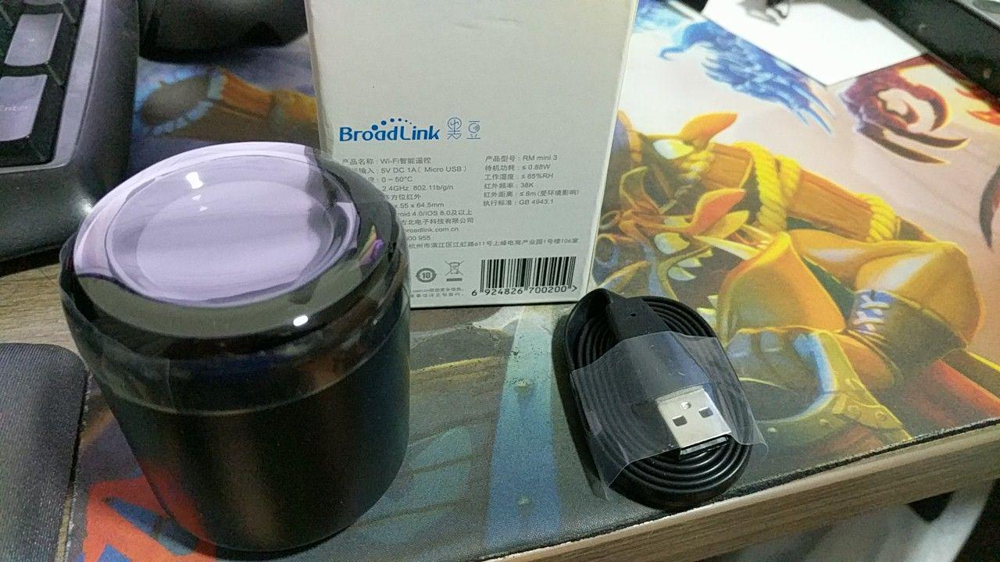
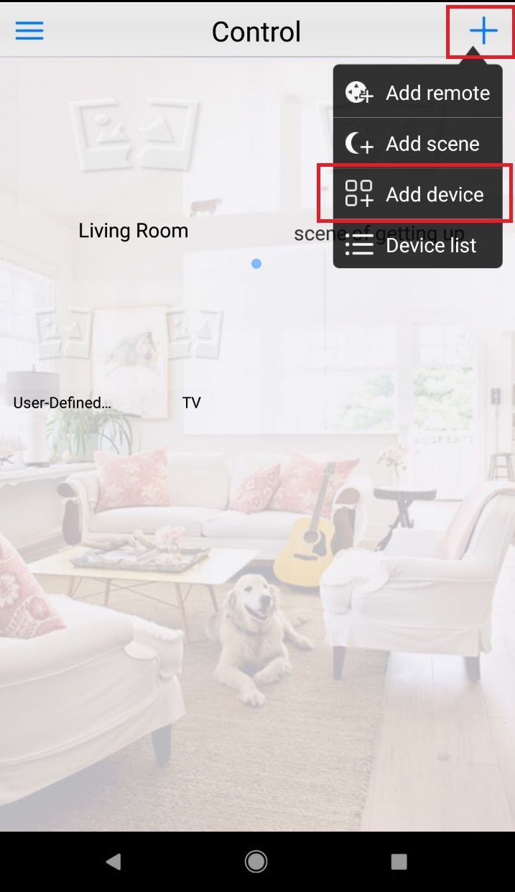
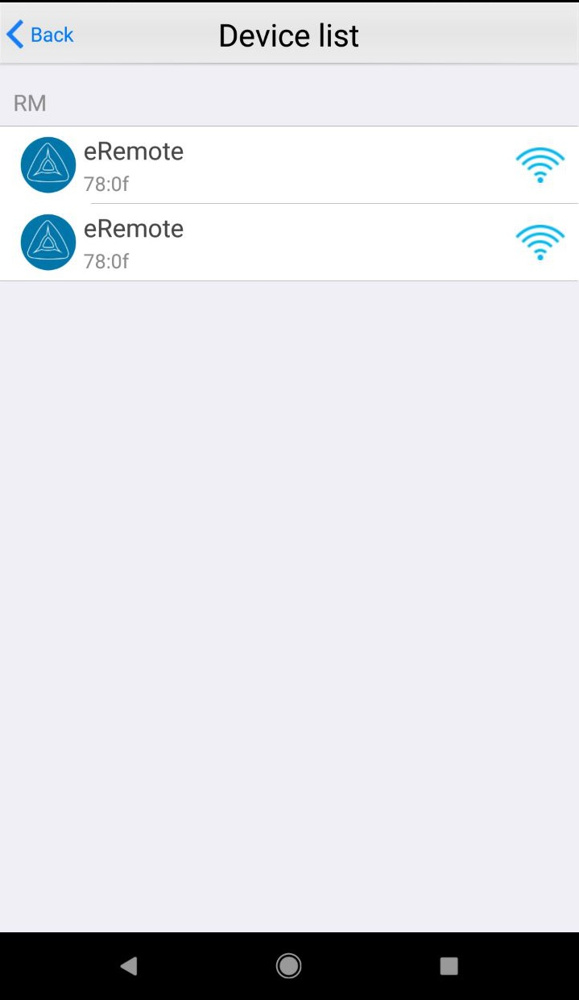

# Telegram IOT Bot
Python / Broadlink powered Telegram bot
Control your home/office devices with Telegram


# Table of contents
- [Introduction](#introduction)
- [Requirements](#requirements)
- [Getting Started](#getting-started)
	* [BotFather](#botfather)
	* [Blackbean Device](#blackbean-devices)
	  * [RM3](#rm3)
	* [Rooms, Devices & Commands](#rooms-devices-commands)
	  * [Rooms](#rooms)
	  * [Devices](#devices)
	    * [Type Enums](#type-enums)
	  * [Device's Commands](#device-commands)
	* [Users](#users)
	* [Sample JSON](#sample-jsons)
	* [Learning Commands](#learning-commands)
	* [Usage](#usage)
	  * [Controlling Devices](#controlling-devices)
	  * [Add Users](#add-users)
	  * [Remove Users](#remove-users)
- [Running the application](#run)
- [Screenshots](#screenshots)
- [Videos](#videos)
- [Future features / Improvements](#future)
- [Contributing](#contributing)
- [License](#license)


# Introduction
Control various devices such as (TV, Aircon, Set Top Box) with this Telegram Bot!


### Features
* Supports various household appliances
* Only Approved users can use the bot
* In-line keyboard menu to control your devices
* Learn and add commands to JSON file for device's commands
* Add / Delete users
* Query Server's last handled request / command


# Requirements
### Requirements
* Python 3.7
* [Python-Broadlink](https://github.com/mjg59/python-broadlink)
* Supported Broadlink Devices
	* [RM2](http://www.ibroadlink.com/rmMini3/)
	* [TC2](http://www.ibroadlink.com/tc2/)
	* [RMPro+](http://www.ibroadlink.com/rmPro+/)
	* etc.

### Optional
* [Raspberry PI](https://www.raspberrypi.org/products/)


# Getting Started
### BotFather
* Create new bot in Telegram
1. Find @BotFather in Telegram
1. Type `/help` for commands
1. Key in `/newbot` and save your bot id and secret


### Blackbean Devices
#### RM3
[Full Manual](http://download.appinthestore.com/201605/Broadlink%20IR%20Remote%20Controller%20Manual.pdf)

* Unbox Device

1. USB Cable, RM3 Device
1. Connect RM3 device with power with USB cable

* Install Mobile App and configure Blackbean device
1. Install Broadlink's e-Control [Link](http://www.ibroadlink.com/app/)
1. 
1. 
1. When successful, your device will show up in device list with the MAC address(`+` -> Device list)


### Rooms Devices Commands
#### Rooms
* To add a room, use the following JSON format and add it to `devices.json` file
* Add the Blackbean device's MAC address that you are placing in the room

eg. Adding Office
```
{
	"office": {
		"mac_address": "780f771abcde",
		"blackbean_type": "RM2",
		"devices": []
	}
}
```

#### Devices
##### Type Enums
| Types  | Devices       |
| -------|:-------------:|
| 1      | Air-con       |
| 2      | TV            |
| 3      | Set Top Box   |

* Model is not used at the moment
* Add to room's `devices` list
* To add device(s) into a room, use the following JSON format

eg. Office's Aircon
```
{
	"type": 1,
	"id": "office-aircon",
	"brand": "daikin",
	"model": "super-multi-nx"
}
```

#### Device Commands
* Only Brand name is used, model is not used at the moment
* Key value of Command interface name -> Command String (from bytearray)
* All device's commands should have at least `power_on` and `power_off` key / value
* Contribute to the project by committing your device's commands

eg. Daikin Aircon commands
```
{
	"1": {
		"daikin": {
			"power_on": "26005002100e0e0e0f0e0e0e0f0e0e00034473380f2a0f0e0f0e0e0e0e2a0f0e0f0e0e0e0f0e0e2a0f0e0e2a0f2a0f0e0f290f2a0f2a0f2a0f2a0f0e0e0f0e2a0f0e0e0e0f0e0e0e0f0e0e0e0e0f0e0e0e0e0f0e0e2a0f0e0f290f0f0e0e0e0e0f291029100e0e0e0e0f0e0e0e0e0f0e0e0e0f0e0e0e0f0e0e0e0e0e0f0e0e0e0f0e0e0e0f290f2a0f2a0f0e0f29100e0e2a0f2a0f00047b73380f2a0f0e0e0e0f0e0e2a0f0e0f0e0e0e0e0f0e2a0f0e0e2a0f2a0f0e0e2a0f2a0f2a0f2a0f2a0f0e0e0e0f29100e0e0e0f0e0e0e0e0e0f0e0e0e0f0e0e0e0f0e0e0e0e2a0f0e0f0e0e0e0f0e0e2a0f0e0e2a0f0e0f29102910290f0f0e0e0e0e0f29100e0e2a0f0e0e0e0f0e0e0e0f0e0e0e0f2910290f0e0f2910291029100e0e00047b73380f2a0f0e0f0e0e0e0e2a0f0e0f0e0e0e0f0e0e2a0f0e0e2b0e2a0f0e0f290f2a0f2a0f2a0f2a0f0e0e0f0e29100e0e0e0f0e0e0e0f0e0e0e0e0e0f0e0e0e0f0e0e0e0f0e0e0e0f0e0e0e0e0e0f0e0e0e0f29100e0e0e0f290f2a0f2a0f0e0f0e0e0e0f0e0e2a0f29100e0e2a0f0e0f0e0e0e0e0e0f0e0e0e0f0e0e0e0f0e0e0e0e2a0f2a0f2a0f2a0f2a0f0e0e2a0f0e0f0e0e0e0f0e0e0e0e0e0f0e0e0e0f0e0e0e0f0e0e0e0f0e0e0e0e0e0f0e0e0e0f0e0e2a0f2b0e0e0e0e0f0e0e0e0f0e0e0e0f0e0e0e0f0d0f0e0e2a0f2a0f0e0f0e0e0e0e0e0f0e0e0e0f0e0e0e0f0e0e0e0f0e0e0e0e0e0f0d0f0e0f0e0e0e0f0e0e0e0f0e0e0e0e0e0f0e0e2a0f2a0f0e0f290f0e0f0e0e0e0f0e0e0e0f0e0e0e0e2a0f0e0f0e0e0e0f0e0e0e0f0e0e0e0e0e0f0e0e0e0f0d0f0e0f0e0e0e0f000d050000000000000000",
			"power_off": "26005002100d0f0d0f0d100d0f0d1000034473371029100d0f0d0f0d1029100d0f0d100d0f0d10290f0d10291029100d0f291029102910290f2a0f0d100d0f2a0f0d100d0f0d0f0d100d0f0d100d0f0d100d0f0d0f2a0f0d1029100d0f0d100d0f291029100d0f0d100d0f0d0f0e0f0d0f0d100d0f0d100d0f0d100d0f0d0f0d100d0f0d102910290f2a0f0d1029100d0f2a0f291000047b73371029100d0f0d100d0f29100d0f0d100d0f0d10290f0e0f291029100d0f2a0f291029102910290f0e0f0d0f2a0f0d100d0f0d100d0f0d0f0d100d0f0d100d0f0d100d0f29100d0f0d100d0f0d1029100d0f29100d10290f0d100d0f0d0f2a0f2a0f0d100d0f0d100d0f0d0f0d100d0f0d1029100d0f0d0f2a0f2a0f0d100d0f0d1000047a733810290f0d100d0f0d1029100d0f0d0f0d100d0f2a0f0d10290f2a0f0d1029102910290f2a0f2a0f0d100d0f29100d0f0d100d0f0d100d0f0d100d0f0d0f0d100d0f0d100d0f0d100d0f0d0f0e0f0d0f0d100d0f0d100d0f2910291029100d0f0d100d0f0d0f2a0f2a0f0d1029100d0f0d0f0d100d0f0d100d0f0d100d0f0d0f0d10291029102910290f2a0f0d1029100d0f0d0f0d100d0f0d100d0f0d100d0f0d0f0e0f0d0f0d100d0f0d100d0f0d100d0f0d0f2a0f2a0f0d100d0f0d100d0f0d0f0d100d0f0d100d0f0d10290f2a0f0d100d0f0d100d0f0d0f0e0f0d0f0d100d0f0d100d0f0d100d0f0d0f0d100d0f0d100d0f0d100d0f0d0f0d100d0f2a0f2a0f0d10290f0d100d0f0d100d0f0d100d0f0d0f2a0f0d100d0f0d100d0f0d100d0f291029102910290f2a0f2a0f2a0f2a0f000d050000000000000000",
			"powerful": "260050020f0e0f0e0e0e0f0e0e0e0e000345723810290f0e0f0e0e0e0f29100e0e0e0f0e0e0e0e2a0f0e0f291029100e0e2a0f291029102910290f0e0f0e0e2a0f0e0f0e0e0e0f0e0e0e0e0e0f0e0e0e0f0e0e0e0f29100d0f29100e0e0e0f0e0e2a0f2a0f0e0e0e0f0e0e0e0f0e0e0e0f0e0e0e0e0e0f0e0e0e0f0e0e0e0f0e0e0e0f0e0e2a0f291029100e0e2a0f0e0e2a0f2b0e00047b73380f2a0f0e0f0e0e0e0f2a0f0e0e0e0e0e0f0e0e2a0f0e0f2910290f0e0f291029102910290f2a0f0e0f0e0e2a0f0e0e0e0f0e0e0e0f0e0e0e0f0e0e0e0f0e0e0e0e0e0f29100e0e0e0f0e0e0e0f290f0e0f0e0e2a0f2a0f2a0f2a0f0e0e0e0f0e0e2a0f0e0f290f0e0f0e0e0e0f0e0e0e0f2910290f2a0f0e0f29102910290f0e0f00047b73380f2a0f0e0e0e0f0e0e2a0f0e0f0e0e0e0e0e0f29100e0e2a0f2a0f0e0e2a0f2a0f2a0f2a0f2a0f0e0e0e0f29100e0e0e0f0e0e0e0e0e0f0e0e0e0f0e0e0e0f0e0e0e0f0e0e0e0e0e0f0e0e0e0f0e0e0e0f290f0f0e0e0e2a0f2a0f2a0f0e0e0e0f0e0e0e0f291029100e0e2a0f0e0e0e0f0e0e0e0f0e0e0e0f0e0e0e0e0e0f0e0e2a0f2a0f2a0f291029100e0e2a0f0e0f0e0e0e0e0e0f0e0e0e0f0e0e0e0f0e0e0e0e0e0f0e0e0e0f0e0e0e0f0e0e0e0f0e0e2a0f29100e0e0e0f0e0e0e0f0e0e0e0e0e0f0e0e0e0f0e0e2a0f2a0f0e0e2a0f0e0f0e0e0e0f0e0e0e0f0e0e0e0e0e0f0e0e0e0f0e0e0e0f0e0e0e0f0e0e0e0e0e0f0e0e0e0f0e0e0e0f290f2a0f0e0f29100e0e0e0f0e0e0e0e0e0f0e0e0e0f29100e0e0e0f0e0e0e0e0e0f0e0e2a0f0e0f0e0e0e0f0e0e0e0e0e0f0e0e000d050000000000000000"
		}
	}
}
```

* See [Sample JSONs](#sample-jsons) for more room and device examples

### Users
* Server will validate both Telegram user's ID and Name
* User will not be able to delete him/her self
* Key value of Telegram User ID -> User Name
* You have to add at least one user and add other users through the first user

eg. Add John's Telegram account with user ID 1234567 and username `John`
```
{
	"1234567": "John"
}
```


### Sample JSONs
* [Rooms & Devices](docs/sample_devices.json)
* [Commands](docs/sample_commands.json)
* [Users](docs/sample_users.json)


### Learning Commands
####


### Usage
#### Controlling devices
#### Add Users
#### Remove Users


# Run
1. Virtualenv
1. install
1. install python-broadlink
1. run! ```python main.py --bot_id <BOT_ID> --bot_secret <BOT_SECRET>```


# Screenshots
### Commands
#### Start (/start)
#### Ping (/ping)
#### Status (/status)
#### List (/list)
#### Keyboard (/keyboard)
#### User (/user)


# Videos
### Turning on/off Aircon

### Turning on/off TV


# Future
### Minor Improvements
- [ ] Improve Room / Device listing
- [ ] Use 2 columns if Inline Keyboard menu buttons are more than 8
- [ ] Sort device's feature with power on and off first
- [ ] Send / Backup JSONs

### Major Features
- [ ] Room / User last command (with time)
- [ ] Custom Macros
- [ ] Favorite Keyboard, custom make your own keyboard view
- [ ] Room / Device CRUD (conversation style)
- [ ] Learn device command (conversation style) (if device command cannot be found / convo command)
- [ ] Set Top Box network provider channel bindings
- [ ] Support TC2 light switches
- [ ] Support Broadlink power strip
- [ ] Restart server
- [ ] Triggers with scheduler (on specific day / time of day / repeatable to do something)


# Contributing


# License
